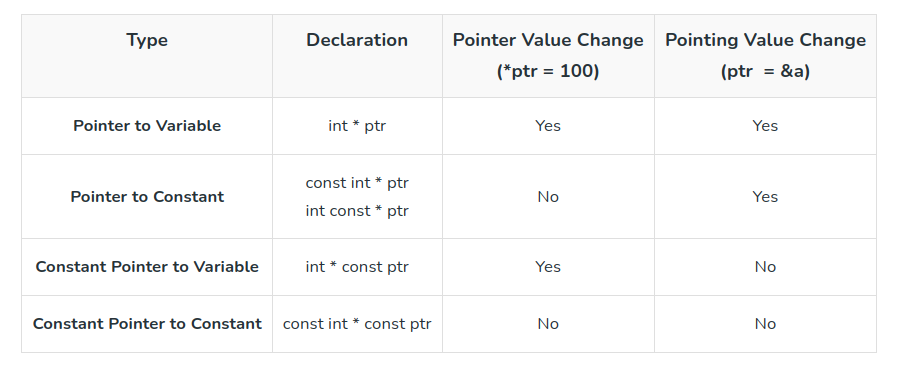

# Variables and Constants
## Variables types
- Local Variables
- Global Variables
- Static Variables
- Automatic Variables
    - all local variable are automatic by default
- Extern Variables
- Register Variables

## Const
- pointer to constant: 
```c
const int * ptr;
```
- constant pointer to variable
```c
int * const ptr
```
- constant pointer to constant
```c
const int * const ptr;
```
